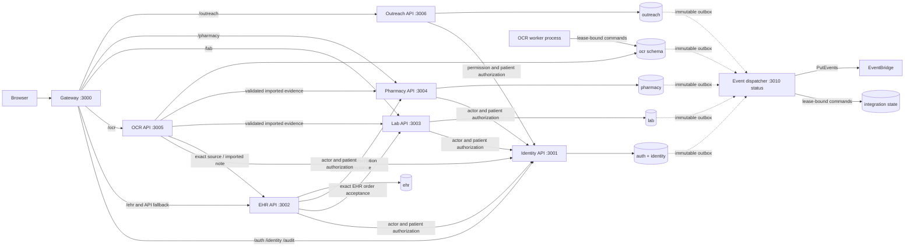

# HID Platform Integration Acceptance

Date: 2026-08-11
Classification: implemented locally with external environment verification pending.

## 2026-08-12 production-convergence addendum

The current production edge supersedes this report's older one-origin frontend
wording: Web, EHR, Lab, Pharmacy, OCR, Outreach, and Admin are seven independent
Cloudflare Workers Static Assets applications. AWS Gateway is API-only.
Notification API owns workload-authenticated authentication OTP delivery on
port 3007. Notification Worker owns ordinary EventBridge/SQS delivery through
Novu/FCM on port 3008. Identity is local/OIDC only; active Supabase, legacy HTTP
identity, Brevo, Vercel target, magic-link, CloudFront, and Gateway-static paths
are absent. Migration `0028` and its deterministic fixture/reconciliation
tooling are additive to immutable `0001`–`0027`.

All details below remain useful local extraction evidence, but any gateway,
service-count, migration-tip, or event-consumer statement that conflicts with
this addendum is a historical 2026-08-11 checkpoint.

This report records the current executable architecture after the Identity,
Lab, Pharmacy, OCR, and Outreach backend extractions. It does not claim production
deployment, Docker execution, live workload-issuer acceptance, real NIN-provider
acceptance, or representative-device Outreach acceptance.

## 1. Service inventory

| Component | Executable owner | Current responsibility | Persistence authority |
| --- | --- | --- | --- |
| Web UI | `apps/web` | Patient portal; independently hosted by Cloudflare in production | None |
| EHR UI | `apps/ehr` | Facility-scoped clinical workspace at `/ehr/` | None |
| Lab UI | `apps/lab` | Facility-scoped accession, custody, execution, and result workspace at `/lab/` | None |
| Pharmacy UI | `apps/pharmacy` | Facility-scoped prescription acceptance, dispensing/reversal, historical medication evidence, lookup, and activity at `/pharmacy/` | None |
| OCR Operations UI | `apps/ocr` | OCR job/document operations and lifecycle state at `/ocr/`; contextual clinical review remains in EHR | None |
| Outreach UI | `apps/outreach` | Encrypted offline field registration at `/outreach/` | Encrypted browser IndexedDB only |
| Admin UI | `apps/admin` | Governed platform administration at `/admin/` | None |
| Identity API | `services/identity-api` | Auth, workforce context, canonical patients/HIDs, NIN registration, consent, break-glass, Identity audit reads | `auth`, `identity`; append-only `audit` |
| EHR API | `services/ehr-api` | EHR clinical intent/records and documents; narrow internal OCR source/import boundary | `ehr`; append-only `audit` |
| OCR API | `services/ocr-api` | OCR jobs, extraction reads, validation, patient confirmation, publication orchestration | `ocr`; append-only `audit` |
| OCR worker | `services/ocr-worker` | Lease-bound extraction worker | Exact `ocr` security-definer commands only |
| Lab API | `services/lab-api` | Lab work, accession/specimen, execution/results, imported evidence | `lab`; append-only `audit` |
| Pharmacy API | `services/pharmacy-api` | Exact prescription acceptance, dispensing/reversal, imported medication evidence | `pharmacy`; append-only `audit` |
| Outreach API | `services/outreach-api` | Temporary field-registration intake and exact existing-patient resolution | `outreach`; append-only `audit` |
| Notification API | `services/notification-api` | Direct authentication OTP delivery; never ordinary workflow/history | Stateless |
| Notification Worker | `services/notification-worker` | Encrypted-queue ordinary notification delivery through Novu/FCM boundary | `notification`; exact queue consumer |
| Event dispatcher | `services/event-dispatcher` | Lease-bound normalization, contract validation, and transport delivery for five domain outboxes | Exact `integration` commands only |
| API-only Gateway | `gateway` | Regional `/api/v1/*` owner-service routing only | None |
| Shared HTTP client | `packages/api-client` | Typed URL, timeout, correlation, credential, idempotency, retry, JSON and Problem Details transport | None |

Canonical authority is singular: Identity owns patient identity; EHR owns EHR
clinical truth; Lab owns Lab truth; Pharmacy owns dispensing truth; Outreach
owns field operational state; OCR owns extraction/validation/publication state.

## 2. Service dependency graph

Every internal clinical mutation is synchronous HTTP at the current boundary.
Each owner commits domain state, semantic audit, and outbox evidence locally;
no distributed database transaction is used.

## 3. Port map

| Port | Current use | Acceptance result |
| --- | --- | --- |
| 3000 | One-origin Vite gateway | Started; EHR health through fallback returned 200 |
| 3001 | Identity API | Started; live and ready returned 200 |
| 3002 | EHR API | Started from `services/ehr-api`; live and ready returned 200 |
| 3003 | Lab API | Started; live and ready returned 200 |
| 3004 | Pharmacy API | Started; live and ready returned 200 |
| 3005 | OCR API | Started independently; live and ready returned 200 |
| 3006 | Outreach API | Started; live and ready returned 200 |
| 3010 | Event dispatcher status | Reserved and unique; service tests/build pass, live EventBridge execution remains external |
| 3100 | Direct Web UI | Available with `npm run dev:web` |
| 3101 | Direct EHR UI | Started with the combined stack |
| 3102 | Direct Lab UI | Started with the combined stack |
| 3103 | Direct Pharmacy UI | Production build and browser/offline smoke pass |
| 3104 | Direct Outreach UI | Started with the combined stack |
| 3105 | Direct OCR Operations UI | Production build and browser/offline smoke pass |
| 3106 | Direct Admin UI | Production build and browser/offline smoke pass |

`scripts/ports.mjs` rejects invalid or duplicate assignments. The platform graph
test confirms all default ports are unique.

## 4. Gateway ownership matrix

| Public prefix | Owner | Runtime evidence |
| --- | --- | --- |
| `/api/v1/auth/*` | Identity 3001 | Identity-owned 401 Problem Details |
| `/api/v1/identity/*` | Identity 3001 | Static proxy matrix plus retired EHR route 404 |
| `/api/v1/audit/*` | Identity 3001 | Static proxy matrix |
| `/api/v1/lab/*` | Lab 3003 | Lab-owned 401 Problem Details |
| `/api/v1/pharmacy/*` | Pharmacy 3004 | Pharmacy-owned 401 Problem Details |
| `/api/v1/ocr/*` | OCR 3005 | Static proxy matrix and standalone composition tests |
| `/api/v1/outreach/*` | Outreach 3006 | Outreach-owned `FACILITY_REQUIRED` response |
| `/api/v1/ehr/*`, other `/api/*` | EHR 3002 | EHR fallback; OCR module is absent |
| `/pharmacy/*` | Pharmacy UI 3103 | UI prefix precedes API fallback; base and nested refresh render |
| `/ocr/*` | OCR UI 3105 | UI prefix precedes API fallback; base and nested refresh render |

Specific routes precede the EHR fallback. Exact old Identity POST and old
Lab/Pharmacy/Outreach EHR routes returned 404. Lab-to-Pharmacy,
Pharmacy-to-Lab, and Identity-to-EHR wrong-service routes also returned 404.

## 5. Runtime-role matrix

| Aggregate role | Inherits | Explicitly excluded |
| --- | --- | --- |
| `hid_identity_api_runtime` | `hid_identity_runtime`, `hid_audit_writer` | EHR, OCR, Lab, Pharmacy, Outreach |
| `hid_ehr_api_runtime` | `hid_ehr_runtime`, `hid_audit_writer` | Identity, OCR, Lab, Pharmacy, Outreach |
| `hid_ocr_api_runtime` | `hid_ocr_runtime`, `hid_audit_writer` | Identity, EHR, Lab, Pharmacy, Outreach |
| `hid_lab_api_runtime` | `hid_lab_runtime`, `hid_audit_writer` | Identity, EHR, OCR, Pharmacy, Outreach |
| `hid_pharmacy_api_runtime` | `hid_pharmacy_runtime`, `hid_audit_writer` | Identity, EHR, OCR, Lab, Outreach |
| `hid_outreach_api_runtime` | `hid_outreach_runtime`, `hid_audit_writer` | Identity, EHR, OCR, Lab, Pharmacy |
| `hid_ocr_worker` | No domain role | All tables; only exact lease-bound OCR functions |
| `hid_event_dispatcher` | No domain role | All tables; only exact delivery claim/result/status functions |
| `hid_event_delivery_commands` | Never inherited | Technical function owner; five domain outbox reads and `integration` state only |
| `hid_api_runtime` | Nothing | Retired and privilege-free |

The idempotent local bootstrap and assertion-only catalog verification passed.
All group roles are NOLOGIN, non-superuser, non-owner, non-`CREATEROLE`,
non-`CREATEDB`, and non-BYPASSRLS. The local combined stack still uses the
development database URL fallback; real non-owner LOGIN membership is external
deployment evidence.

## 6. Workload-identity matrix

| Caller | Target | Audience / approved subject rule | User evidence remains separate |
| --- | --- | --- | --- |
| EHR | Identity | `hid-identity-api`; exact EHR subject | Yes |
| Lab | Identity | `hid-identity-api`; exact Lab subject | Yes |
| Pharmacy | Identity | `hid-identity-api`; exact Pharmacy subject | Yes |
| OCR | Identity | `hid-identity-api`; exact OCR subject | Yes |
| OCR | EHR | `hid-ehr-api`; exact OCR subject | Yes |
| Outreach | Identity | `hid-identity-api`; exact Outreach subject | Yes |
| EHR | Lab | `hid-lab-api`; exact EHR subject | Yes |
| OCR | Lab | `hid-lab-api`; exact OCR subject | Yes |
| EHR | Pharmacy | `hid-pharmacy-api`; exact EHR subject | Yes |
| OCR | Pharmacy | `hid-pharmacy-api`; exact OCR subject | Yes |

Production configuration requires HTTPS issuer/JWKS URLs, asymmetric JWT
verification, expiry/signature, exact audience and subject, and rotating token
files. Inbound JWT bodies are capped at 16,384 characters before JOSE. Mounted
files are regular-file and size checked. Local secrets are per-caller,
process-generated, and rejected by production configuration.

## 7. Cross-service authorization

Internal commands require both layers:

1. independent workload identity and exact declared caller; and
2. propagated user actor evidence, facility, purpose, correlation, and patient
   authorization.

User evidence may be a bearer token or the Identity session cookie. The EHR,
Lab, and Pharmacy adapters now preserve cookie, CSRF token, and Origin. Lab and
Pharmacy select `POST /auth/service-session` for cookie-authenticated unsafe
methods, causing Identity to revalidate Origin and CSRF. They then call the
Identity patient decision endpoint with the same user evidence. Workload
credentials are never put in `Authorization`, and user credentials are never
put in workload headers.

## 8. Idempotency matrix

| Flow | Stable key / binding | Owner behavior |
| --- | --- | --- |
| EHR clinical create | Caller key + operation + request digest | Replay returns prior resource; changed digest conflicts |
| EHR active Lab order to Lab | `ehr-order:<order UUID>:<version>`; Lab also binds exact source/version | At-most-once Lab work item |
| EHR prescription to Pharmacy | Original caller key + exact active prescription version | At-most-once Pharmacy work item |
| OCR publication to EHR/Lab/Pharmacy | Durable publication UUID; downstream `ocr-publication:<UUID>` | Retry-safe across partial failure |
| Identity NIN resolve/review | Actor/facility/key + digest and expected version | Replay or explicit conflict |
| Lab commands | Actor/facility/key + digest and exact aggregate version | Replay or explicit conflict |
| Pharmacy commands | Actor/facility/key + digest and exact aggregate version | Replay or explicit conflict |
| Outreach intake/link | Actor/facility/operation/key + digest | Replay without duplicate evidence |

Retries reuse the correlation ID, user evidence, caller name, body, and
idempotency key. Workload authorization is refreshed for each HTTP attempt.

## 9. Timeout and retry matrix

| Client or workflow | Timeout | Retry policy |
| --- | --- | --- |
| Shared Identity client | 5 seconds default; EHR adapter uses 10 seconds | One retry only when an idempotency key exists and failure is network/502/503/504 |
| EHR or OCR to Lab | 10 seconds | One retry only for idempotent network/502/503/504 failure |
| EHR or OCR to Pharmacy | 10 seconds | Same bounded policy |
| OCR to EHR | 10 seconds | Source GET is not retried; publication retries once only with stable idempotency |
| Browser to Outreach | 10 seconds | Same bounded policy |
| OCR publication command | 60-second processing claim, maximum attempts persisted, 15-second next-attempt delay | Terminal 4xx is not retried; transient owner failure remains failed/retryable and never reports published |

GETs and non-idempotent calls are not automatically retried. Domain 4xx,
including idempotency conflicts, are not retried. Abort signals stop retry.

## 10. Database ownership

The active-source mutation scan produced this exact matrix:

| Executable | Schemas directly mutated in active code | Cross-domain direct mutation |
| --- | --- | --- |
| Identity | `auth`, `identity`, `audit` | None |
| EHR | `ehr`, `audit` | None |
| OCR | `ocr`, `audit` | None; static scan also rejects foreign-domain SQL reads |
| Lab | `lab`, `audit` | None |
| Pharmacy | `pharmacy`, `audit` | None |
| Outreach | `outreach`, `audit` | None |

EHR retains inactive compatibility source for old Identity/Auth/Consent logic,
but `AppModule` does not register it; a composition test and live exact-route
404 prove it is not an active writer. Constrained cross-schema authorization
functions are decisions, not mutation ownership.

## 11. Break-glass verification

Identity alone activates reasoned, time-bounded, emergency-purpose
break-glass. Identity decisions mark the grant. EHR, Lab, Pharmacy, OCR
publication, and Outreach patient resolution reject mutation when
`breakGlass=true`. Fresh Lab and Pharmacy unit evidence verifies denial before
opening a domain transaction. The previously accepted rollback-only RLS suite
contains the database-level read-only, purpose, actor, membership, facility,
patient, expiry, revocation, and deny-precedence cases.

## 12. PHI logging review

Generic process logs contain startup address, correlation ID, HTTP status,
stable problem code, exception type, and database error code only. They do not
log request/response bodies, cookies, tokens, NIN, names, medication text,
result values, notes, or documents. Semantic audit and outbox persistence use
canonical IDs, workflow state, versions, counts, and minimum provenance.
Outbox payload inspection found no raw NIN/HID, demographics, clinical note
content, medication text, or Lab result value. Domain tables necessarily retain
their governed clinical/operational data.

## 13. Failure-injection results

| Negative case | Result |
| --- | --- |
| Wrong workload token/caller/subject | 401/403 fail closed |
| Oversized workload JWT/file | Rejected before JOSE/file read |
| Cookie mutation without bypass | Cookie/CSRF/Origin propagated; Identity mutation validation selected |
| First 503 then success | Exactly one retry with unchanged operation context and refreshed workload token |
| Two 503s / malformed non-JSON problem | Exactly two attempts, then dependency error; no fake success |
| Domain 409 | One attempt; Problem Details preserved |
| Readiness dependency failure | Unit tests reject readiness while liveness remains process-only |
| Wrong or retired service route | Exact runtime request returned 404 |
| Unresolved Outreach patient | Remains temporary and `identity_resolution_pending` |
| Unvalidated OCR candidate | Cannot publish; target and version evidence required |
| Unreleased Lab result for normal reader | Hidden with 404 |
| Pharmacy accepted but not dispensed | Accepted item returns `dispensing: null`; dispensing is a separate command |
| Identity ambiguity | Remains review/pending approval; resolution does not create a patient |

## 14. Multi-service workflow verification

| Workflow | Verified boundary behavior |
| --- | --- |
| EHR active order to Lab | Exact order snapshot, canonical patient UUID, user + workload separation, stable downstream key, transient retry |
| EHR active prescription to Pharmacy | Eligibility/version checked before HTTP; acceptance remains distinct from dispense |
| OCR validation to Lab | Durable publication command; exact validation/provenance; idempotent Lab imported evidence |
| OCR validation to EHR | Typed exact-document boundary and publication-bound imported draft note with immutable provenance |
| OCR validation to Pharmacy | Historical evidence only; never prescription/work/dispensing |
| Outreach to Identity | Temporary intake first; Identity authorizes an explicit exact existing-patient link before transaction |

The six HTTP API processes ran concurrently and route-level boundaries were
exercised. The worker was exercised separately with both HTTP APIs stopped.
An authenticated end-to-end clinical mutation with deployment-equivalent JWTs
was not claimed; live issuer/token mounts remain external.

## 15. Health and readiness results

| Service | Live | Ready | Convergence smoke |
| --- | --- | --- | --- |
| Identity | 200 | 200 | Fresh combined-graph pass |
| EHR | 200 | 200 | Fresh combined-graph pass from `services/ehr-api` |
| OCR | 200 | 200 | Fresh combined-graph pass |
| Lab | 200 | 200 | Fresh combined-graph pass |
| Pharmacy | 200 | 200 | Fresh combined-graph pass |
| Outreach | 200 | 200 | Fresh combined-graph pass |

Liveness does not probe dependencies. Readiness probes each service's
PostgreSQL dependency; EHR additionally probes its configured storage adapter.
These results are local readiness evidence only, not production performance.

## 16. Build and test results

| Target | Result |
| --- | --- |
| Identity API | 13 suites / 39 tests; typecheck and build pass |
| EHR API | 23 suites / 70 tests; strict TypeScript build pass |
| OCR worker | 3 suites / 8 tests; strict TypeScript build pass |
| OCR API | 8 suites / 27 tests; strict typecheck and build pass |
| Lab API | 11 suites / 31 tests; typecheck and build pass |
| Pharmacy API | 7 suites / 17 tests; typecheck and build pass |
| Outreach API | 7 suites / 15 tests; typecheck and build pass |
| Shared API client | Typecheck and build pass; transport contracts execute in consumer suites |
| Identity/Outreach frontend contracts | Both verification scripts pass |
| Pharmacy frontend | 36 tests including route/auth/offline/domain/telemetry policy; production build passes |
| OCR frontend | 13 route/auth/offline/domain tests; production build passes |
| Seven-app frontend policy | Offline/telemetry static contracts, source/bundle security scans, seven builds, nine browser routes, and seven production offline shells pass |
| Aggregate root tests | 303 pass: Admin 19, Pharmacy 36, OCR 13, and 235 API/worker/dispatcher tests |
| Root production build | All seven apps, shared packages, all six APIs, OCR worker, and event dispatcher pass |
| Platform graph | `npm run verify:platform-graph` passes |

The six API packages plus the worker total 72 suites and 207 passing tests. The
full root production build and every backend lint/typecheck pass.

Frontend packages have no standalone lint script; their TypeScript compilation
executes in the production builds.

## 17. Migration state

- Applied migrations are `0001` through `0027`; this frontend checkpoint adds
  no migration and does not edit any applied file. `0026` owns transactional
  delivery/inbox state and `0027` owns the governed Super Admin foundation.
- `db:plan`: zero pending.
- `db:dry-run`: passed and rolled back.
- Runtime-role bootstrap and catalog assertions: passed.
- Assertion-only role verification: passed.
- The complete `schema.integration.sql` schema/RLS suite executed against local
  PostgreSQL and completed through its intentional `ROLLBACK`.

## 18. External verification pending

- Production HTTPS workload issuer/JWKS, audience, exact subject, expiry, and
  rotating token-mount behavior.
- Environment-specific non-owner LOGINs inheriting only the reviewed aggregate
  roles.
- Real NIN provider acceptance.
- Docker builds (Docker is unavailable locally), image scanning, and runtime.
- AWS/private-network/TLS/secrets deployment and operational observability.
- Representative-device Outreach offline reload/reconnect/quota/key-loss tests.
- Representative-device offline acceptance for every installable application.
- Authenticated deployment route/cross-app session verification for Pharmacy,
  OCR, and the complete seven-app workspace graph.
- Live Sentry/PostHog delivery observation with environment keys and the
  documented PHI-safe payload policy.
- Authenticated deployment-equivalent OCR publication across EHR, Lab,
  Pharmacy, and document-only targets.
- Live EventBridge bus/IAM partial-result execution, dispatcher PostgreSQL TLS,
  environment-specific dispatcher LOGIN, built-image execution, drain, and
  metrics/alert evidence.

## 19. Known transitional architecture

- OCR API controllers run only from `services/ocr-api` on 3005. The worker runs
  only from `services/ocr-worker`, imports no EHR/OCR API application code, and
  is independently runnable. EHR runs only from `services/ehr-api`; the former
  `ehr/server` entry point is absent.
- The local launcher starts the worker only with an explicit worker database URL
  and non-disabled provider. Worker-only smoke reached database/provider
  readiness with both APIs stopped, then claims failed closed because the local
  checkout has no registered `ocr_worker` principal or dedicated worker LOGIN.
  Those deployment identities remain external evidence.
- The local orchestrator may fall back to one development `DATABASE_URL`; the
  catalog role model is stricter than the local process-login topology.
- Five domain outboxes feed the implemented neutral dispatcher/inbox
  foundation. EHR has no producer and no product consumer is active; the root
  launcher keeps dispatch disabled until configuration is explicit.
- Lab, Pharmacy, OCR Operations, Outreach, and Admin now have independent
  canonical `apps/*` frontends. Contextual OCR clinical review remains in EHR
  by design rather than as duplicate OCR operations authority.
- Dockerfiles exist for Identity, EHR, Lab, Pharmacy, OCR API, OCR worker,
  Outreach, and the event dispatcher. Static root build context, production command, non-root runtime,
  and secret exclusions pass inspection; image execution remains external.

## 20. Recommended next stage

The next stage is **Full Platform Container Acceptance** for all seven browser
applications, six APIs, OCR Worker, Event Dispatcher, and the gateway. It must
build/scan/run exact images and retain workload JWT, production non-owner LOGIN/
RDS TLS, EventBridge/IAM, AWS OCR/storage, NIN-provider, live telemetry, and
representative-device evidence as explicit external tracks. AWS infrastructure
or deployment begins only after that acceptance stage is authorized.

## 21. Transactional event delivery acceptance addendum

The detailed authoritative topology is `EVENT_DELIVERY_ARCHITECTURE.md`.
Clean PostgreSQL 16 execution applied all 26 migrations, then passed corrective
role provisioning/assertions and the complete rollback-only schema/RLS suite.
The suite discovered 20 events across all five producers and proved active-
lease exclusion, stable expired-lease redelivery, stale-token rejection,
bounded retry/terminal evidence, per-consumer duplicate suppression,
independent consumers, and consumer effect/marker rollback and retry.

The dispatcher has 18 passing unit tests, strict typecheck/build, and root
graph verification. Tests cover envelope policy and unsupported versions,
EventBridge partial success, timeout/authorization classification, and the
publish-accepted/database-mark-failed crash window. Docker and exact-bus IAM
contracts pass static inspection; Docker and live AWS execution remain
external because those environments are unavailable locally.

## 22. Governed Super Admin integration addendum

The current repository adds a dedicated Admin frontend on standalone port
`3106` and gateway path `/admin/`. Browser administration uses only
Identity-owned `/api/v1/admin/*`; the Admin application has no database client,
credential, or redundant BFF. Platform roles resolve separate `platform.*`
capabilities and grant neither clinical authority nor break-glass.

Additive migration `0027_super_admin_foundation.sql` leaves `0001` through
`0026` unchanged. It provides versioned, reasoned, idempotent facility,
principal, role, and session commands; immutable evidence; bounded review and
audit reads; and PHI-minimal terminal delivery failures. Account, role, and
facility mutations that could remove the final reachable Super Admin share a
serialized database invariant. The Admin event view remains read-only because
the dispatcher has no governed arbitrary retry command.

Local evidence passes Admin 19 tests, Identity 49 tests, Dispatcher 18 tests,
strict builds, the runtime-role catalog assertions, full rollback-only
schema/RLS suite, zero-pending migration plan, platform graph verifier, and
root production build. Docker/image scanning, production LOGIN/RDS TLS,
workload identity, EventBridge/IAM/ECS/ECR/CloudWatch, and representative-device
checks remain external.

## 23. Seven-application frontend platform addendum

The canonical browser topology is Web 3100, EHR 3101, Lab 3102, Pharmacy 3103,
Outreach 3104, OCR 3105, and Admin 3106. The gateway serves all seven UI paths
and keeps Pharmacy/OCR UI routing distinct from their owning API prefixes.
Pharmacy and OCR are API-backed workspaces rather than shells: Pharmacy
preserves acceptance/dispensing/reversal/evidence truth, while OCR exposes only
implemented job/document operations and leaves clinical review in EHR.

`packages/offline` and `packages/telemetry` are shared by every app. All workers
have exact scopes, cache only static shell/assets, and exclude `/api/`. Outreach
retains the only encrypted persisted mutation outbox; all other apps fail safely
without inventing authoritative offline state. Sentry/PostHog share one strict
redaction/allowlist policy; all session replay and automatic capture are
disabled.

Local evidence includes the canonical root build, aggregate 303-test root run,
shared offline/telemetry verification, Outreach encrypted-outbox
regression, source and production-bundle security scans, nine gateway browser
routes, and clean-profile production Chrome offline reloads for all seven apps.
No unexpected browser exception was observed and no Cache Storage entry used an
`/api/` URL. This is desktop local evidence only: authenticated external flows,
representative devices, live telemetry destinations, Docker, and AWS remain
pending.
